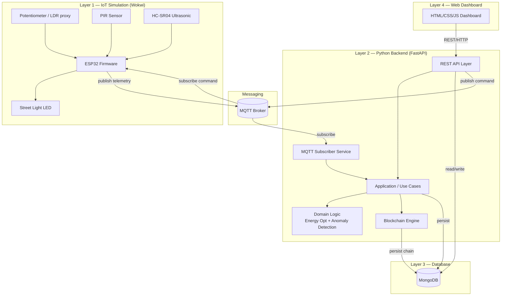
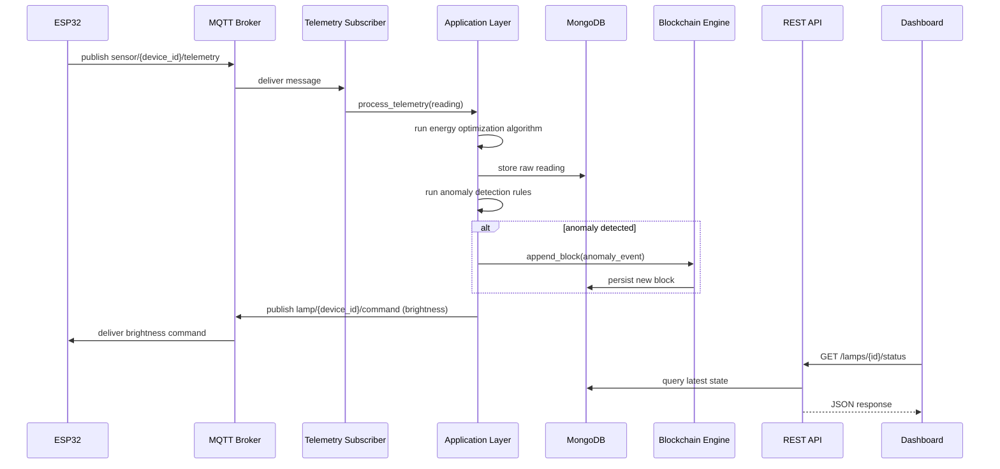
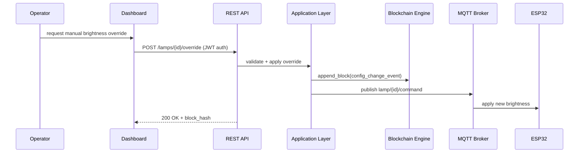
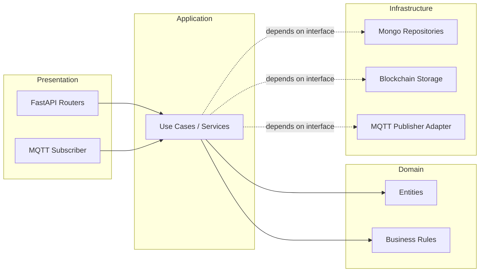

# Smart City Public Lighting and Traffic Monitoring with Blockchain Traceability
## Architecture & Design Document (Pre-Implementation)

**Status:** Design phase — no code written yet, per project instructions.
**Audience:** University engineering project (production-quality patterns, academic-appropriate scope).

---

## 1. Requirements Analysis — Gaps & Improvements

Before designing anything, here are the ambiguities in the original brief and the decisions I'm proposing to resolve them. Flag any you disagree with and we'll adjust.

### 1.1 Missing Specifications Identified

| # | Gap | Proposed Resolution |
|---|-----|---------------------|
| G1 | How does ESP32 talk to the backend? (MQTT vs HTTP vs WebSocket) | **MQTT** for telemetry (pub/sub, lightweight, standard for IoT), **HTTP REST** for dashboard/API/config. This is the industry-realistic pattern and demonstrates two communication paradigms — good for grading rubrics that reward architectural depth. |
| G2 | What triggers a "Blockchain-worthy" event vs a routine telemetry write? | Define explicit **event classes**: (a) anomaly detected, (b) lamp failure, (c) manual/automatic configuration change, (d) system threshold breach. Routine sensor readings go to MongoDB only — the chain isn't a time-series database. |
| G3 | Single lamp/pole or a network of poles? | Design for **N independent "lamp nodes"**, each with a unique `device_id`, so the system demonstrates multi-node scalability even if only 1–3 physical/simulated nodes exist in Wokwi. |
| G4 | What counts as an "anomaly"? | Define concrete rules: sensor value out of physical range, no telemetry received within timeout (offline lamp), LED not responding to brightness command (actuator mismatch), abnormal traffic spike vs baseline. |
| G5 | Real blockchain (Ethereum/Hyperledger) or custom local chain? | Brief says "local Blockchain" — I recommend a **custom lightweight Python blockchain** (linked-list of blocks, SHA-256 hashing, simple PoW or PoA consensus stub). This keeps scope realistic for a course project while still demonstrating the core blockchain principles (immutability, hash-chaining, tamper-evidence) rather than requiring Solidity/Ethereum tooling. |
| G6 | Multi-user roles? | Add minimal **RBAC**: `admin` (can override lighting, view all), `operator` (can view + acknowledge alerts), `viewer` (read-only dashboard). Keeps auth realistic without heavy scope. |
| G7 | Authentication for API/dashboard? | JWT-based auth for write endpoints; dashboard read endpoints can be open for demo simplicity, but the design should allow enabling auth everywhere via config. |
| G8 | Historical data retention / aggregation? | Define a **rollup strategy**: raw readings kept for N days, then aggregated into hourly/daily stats collections — demonstrates data lifecycle thinking. |
| G9 | Environmental "conditions" for light adjustment — just ambient light, or also time-of-day/weather? | Use potentiometer (ambient light proxy) + time-of-day heuristic as a secondary factor. Weather API integration is a **stretch goal**, not core scope. |
| G10 | Testing scope? | Brief says "API regression testing" — I'll scope this to **automated pytest suite** against FastAPI endpoints (using `TestClient`), plus a smoke-test for blockchain integrity, run in CI. |
| G11 | Deployment target? | Local Docker Compose is sufficient for academic delivery; no cloud deployment assumed unless you want to add it as a stretch milestone. |

### 1.2 Suggested Improvements Beyond the Brief

1. **Idempotency & offline buffering**: ESP32 should timestamp readings locally and the backend should tolerate out-of-order/late MQTT messages — a realistic IoT concern worth modeling even in simulation.
2. **Energy savings metric**: Explicitly compute and expose a "kWh saved vs baseline (always-on)" metric — this becomes a strong dashboard KPI and a good grading talking point.
3. **Blockchain explorer as a first-class API**, not just a UI feature — makes the chain auditable programmatically, which is closer to real-world traceability systems.
4. **Chain integrity verification endpoint** (`/blockchain/verify`) — walks the whole chain and validates hashes; great for demoing tamper-evidence live.
5. **Separation of "simulation harness" from "backend"**: since Wokwi is a simulator, provide a small **Python IoT simulator/replay script** as a fallback so the backend/demo doesn't hard-depend on Wokwi being open during grading.

---

## 2. Software Architecture

### 2.1 High-Level Style

**Layered / Clean Architecture**, adapted for an IoT + backend + blockchain system:

- **Domain layer**: entities (SensorReading, LampNode, Anomaly, Block, TrafficEvent) and business rules (energy optimization algorithm, anomaly detection rules) — framework-agnostic, pure Python.
- **Application layer**: use cases / services (ProcessTelemetryUseCase, DetectAnomalyUseCase, AdjustLightingUseCase, RecordBlockchainEventUseCase) — orchestrates domain logic + repositories.
- **Infrastructure layer**: MongoDB repository implementations, MQTT client adapter, Blockchain persistence, REST controllers (FastAPI routers).
- **Interface/Presentation layer**: FastAPI routers (HTTP), MQTT subscriber (message-driven entrypoint), and the web dashboard (separate deployable frontend).

This gives dependency inversion: domain and application layers never import FastAPI or PyMongo directly — they depend on repository **interfaces** (Python `Protocol`/ABC), and infrastructure implements them. This is realistic Clean Architecture without over-engineering for a student project.

### 2.2 Logical Components

```
[ESP32 Simulated Node] --MQTT(telemetry)--> [MQTT Broker] --> [Telemetry Subscriber Service]
                                                                        |
                                                                        v
                                                      [Application Layer / Use Cases]
                                                        - Energy Optimization Algorithm
                                                        - Anomaly Detection Engine
                                                        - Traffic Analytics
                                                              |         |
                                                              v         v
                                                     [MongoDB Repo]  [Blockchain Engine]
                                                              |         |
                                                              +----+----+
                                                                   v
                                                          [FastAPI REST Layer]
                                                                   |
                                                                   v
                                                        [Web Dashboard (HTML/JS)]
```

Command path (dashboard → lamp) flows the opposite direction: Dashboard → REST API (`/lamps/{id}/override`) → Application layer validates → publishes MQTT command topic → ESP32 subscribes and adjusts LED.

---

## 3. Mermaid Diagrams

### 3.1 System Architecture (Component Diagram)



### 3.2 Telemetry Sequence Flow



### 3.3 Manual Override / Config Change Flow



### 3.4 Data Flow / Layered Architecture (Clean Architecture View)



---

## 4. Communication Flow Between Layers

| From | To | Protocol | Purpose |
|------|----|----------|---------|
| ESP32 | MQTT Broker | MQTT (pub) | Telemetry (light level, PIR state, distance/vehicle presence) |
| MQTT Broker | Backend (Subscriber) | MQTT (sub) | Ingest telemetry into application layer |
| Backend | MQTT Broker | MQTT (pub) | Push brightness/command updates to lamp nodes |
| MQTT Broker | ESP32 | MQTT (sub) | Receive brightness command, update LED PWM |
| Dashboard | Backend | HTTP REST (JSON) | Queries, overrides, blockchain explorer, alerts |
| Backend | MongoDB | Mongo Wire Protocol (via Motor/PyMongo) | Persistence |
| Backend | Blockchain Engine | In-process function calls | Append/verify blocks (chain persisted to Mongo as an immutable-by-convention collection) |

**Topic naming convention (MQTT):**
- `smartcity/{device_id}/telemetry` — sensor data, published by ESP32
- `smartcity/{device_id}/command` — brightness/config commands, published by backend
- `smartcity/{device_id}/status` — online/offline heartbeat (LWT — Last Will and Testament)

Using MQTT's **Last Will and Testament** feature is a nice realistic touch: if a lamp node disconnects unexpectedly, the broker auto-publishes an offline status, which the backend turns into an anomaly + blockchain entry — this alone is a good demo of "the system detects a lamp failure."

---

## 5. REST API Design

Base path: `/api/v1`

### 5.1 Lamp / Lighting

| Method | Path | Description | Auth |
|--------|------|-------------|------|
| GET | `/lamps` | List all lamp nodes + current status | viewer+ |
| GET | `/lamps/{device_id}` | Detail: current brightness, last reading, health | viewer+ |
| GET | `/lamps/{device_id}/history` | Historical readings (paginated, time-range filter) | viewer+ |
| POST | `/lamps/{device_id}/override` | Manual brightness override | operator+ |
| PATCH | `/lamps/{device_id}/config` | Update thresholds/config for a node | admin |

### 5.2 Traffic

| Method | Path | Description | Auth |
|--------|------|-------------|------|
| GET | `/traffic/{device_id}/current` | Current pedestrian/vehicle counts | viewer+ |
| GET | `/traffic/{device_id}/stats` | Aggregated stats (hourly/daily) | viewer+ |
| GET | `/traffic/summary` | City-wide traffic summary | viewer+ |

### 5.3 Anomalies / Alerts

| Method | Path | Description | Auth |
|--------|------|-------------|------|
| GET | `/alerts` | List anomalies (filter by status/severity/device) | viewer+ |
| POST | `/alerts/{alert_id}/acknowledge` | Mark alert as acknowledged | operator+ |

### 5.4 Blockchain Explorer

| Method | Path | Description | Auth |
|--------|------|-------------|------|
| GET | `/blockchain/blocks` | List blocks (paginated) | viewer+ |
| GET | `/blockchain/blocks/{index}` | Block detail | viewer+ |
| GET | `/blockchain/verify` | Verify full chain integrity | viewer+ |
| GET | `/blockchain/events?device_id=` | Filter chain events by device | viewer+ |

### 5.5 System / Auth

| Method | Path | Description | Auth |
|--------|------|-------------|------|
| POST | `/auth/login` | Obtain JWT | public |
| GET | `/system/health` | Health check (Mongo, MQTT broker connectivity) | public |
| GET | `/system/energy-savings` | Aggregated kWh-saved KPI | viewer+ |

### 5.6 API Conventions

- All responses: `{"data": ..., "meta": {...}}` envelope for consistency.
- Errors follow a standard `{"error": {"code": ..., "message": ...}}` shape.
- Pagination via `?page=&page_size=`, filtering via query params, ISO-8601 timestamps everywhere.
- Versioned under `/api/v1` so breaking changes don't affect the dashboard mid-development.

---

## 6. MongoDB Collections Design

### 6.1 `sensor_readings` (raw telemetry, time-series-like)
```json
{
  "_id": "ObjectId",
  "device_id": "lamp-001",
  "timestamp": "ISODate",
  "ambient_light_pct": 42,
  "pir_triggered": true,
  "distance_cm": 120.5,
  "vehicle_detected": false,
  "led_brightness_pct": 65
}
```
*Recommend MongoDB **time series collection** type for this one — directly fits the use case and is a nice technical detail for the report.*

### 6.2 `lamp_nodes` (current state / device registry)
```json
{
  "_id": "lamp-001",
  "location": {"lat": 36.8, "lng": 10.18, "label": "Main St & 5th"},
  "status": "online",
  "current_brightness_pct": 65,
  "last_seen": "ISODate",
  "config": {"min_brightness": 10, "max_brightness": 100, "anomaly_thresholds": {...}},
  "firmware_version": "1.0.0"
}
```

### 6.3 `traffic_stats` (aggregated rollups)
```json
{
  "_id": "ObjectId",
  "device_id": "lamp-001",
  "period": "hourly",
  "period_start": "ISODate",
  "pedestrian_count": 34,
  "vehicle_count": 12,
  "avg_vehicle_speed_estimate": 18.2
}
```

### 6.4 `anomalies`
```json
{
  "_id": "ObjectId",
  "device_id": "lamp-001",
  "type": "lamp_offline | sensor_out_of_range | actuator_mismatch | traffic_spike",
  "severity": "low | medium | high",
  "detected_at": "ISODate",
  "resolved": false,
  "acknowledged_by": null,
  "blockchain_ref": "block_hash_or_index"
}
```

### 6.5 `blockchain` (append-only ledger persistence)
```json
{
  "_id": "ObjectId",
  "index": 42,
  "timestamp": "ISODate",
  "previous_hash": "abc123...",
  "hash": "def456...",
  "nonce": 1337,
  "data": { "event_type": "anomaly", "device_id": "lamp-001", "payload": {...} }
}
```
*Enforced immutability at the application layer (no update/delete use cases exposed for this collection) plus hash-chain verification — MongoDB itself doesn't guarantee immutability, so this is explicitly a design decision to call out in your report (see §12).*

### 6.6 `users` (auth/RBAC)
```json
{
  "_id": "ObjectId",
  "username": "operator1",
  "password_hash": "...",
  "role": "admin | operator | viewer"
}
```

### 6.7 Indexing Strategy
- `sensor_readings`: compound index on `(device_id, timestamp)`.
- `anomalies`: index on `(device_id, resolved, severity)`.
- `blockchain`: unique index on `index`, index on `hash`.

---

## 7. Blockchain Data Structure Design

### 7.1 Block Structure

| Field | Type | Description |
|-------|------|--------------|
| `index` | int | Position in the chain |
| `timestamp` | datetime | Block creation time |
| `data` | object | Event payload (anomaly, config change, lamp failure) |
| `previous_hash` | string | SHA-256 hash of the previous block |
| `nonce` | int | Proof-of-work nonce (lightweight difficulty for demo purposes) |
| `hash` | string | SHA-256 hash of this block's contents |

### 7.2 Consensus Model

For an academic single-node backend, a full distributed consensus (PoW across nodes, PBFT, etc.) is out of scope and would add complexity without pedagogical value here. Instead:

- Implement a **lightweight Proof-of-Work** (e.g., hash must start with `N` leading zeros, small `N` like 3–4) purely to demonstrate the *concept* of mining/computational cost.
- Architect the `ConsensusStrategy` as a **pluggable interface** (`Protocol`), so a stretch goal could swap in Proof-of-Authority or a multi-node Raft-based setup without touching the rest of the system — good talking point for "future work" in your report.

### 7.3 Event Types Recorded on Chain

1. `anomaly_detected` — sensor/lamp anomaly with severity and evidence snapshot.
2. `lamp_failure` — actuator not responding / offline beyond timeout.
3. `config_change` — manual override or threshold update, with `actor` (user) and `reason`.
4. `system_alert` — city-wide threshold breach (e.g., mass lamp outage).

### 7.4 Integrity Verification

`verify_chain()` walks every block, recomputes its hash from `(index, timestamp, data, previous_hash, nonce)`, and confirms it matches the stored hash **and** matches the next block's `previous_hash`. Exposed via `GET /blockchain/verify` — returns `{valid: bool, broken_at_index: int|null}`.

### 7.5 Why a Custom Chain Instead of Ethereum/Hyperledger

- Avoids heavy infra (nodes, gas, wallets) inappropriate for a course timeline.
- Still teaches the core primitives: hash-chaining, tamper-evidence, immutability-by-design, block validation.
- Keeps the system self-contained in Docker Compose (no external testnet dependency) — much more demo-reliable.

---

## 8. Proposed Project Folder Structure

```
smart-city-platform/
├── docker-compose.yml
├── .env.example
├── README.md
├── docs/
│   ├── architecture.md          (this document)
│   ├── api-spec.yaml             (OpenAPI, generated + curated)
│   └── diagrams/
│
├── iot-firmware/                 (Wokwi / ESP32 simulation)
│   ├── src/
│   │   └── main.cpp
│   ├── diagram.json              (Wokwi wiring diagram)
│   ├── wokwi.toml
│   └── platformio.ini
│
├── backend/
│   ├── Dockerfile
│   ├── requirements.txt
│   ├── pyproject.toml
│   ├── app/
│   │   ├── main.py                       # FastAPI entrypoint
│   │   ├── config.py                     # settings (pydantic-settings)
│   │   │
│   │   ├── domain/
│   │   │   ├── entities/                 # SensorReading, LampNode, Anomaly, Block...
│   │   │   ├── rules/                    # energy optimization, anomaly detection
│   │   │   └── interfaces/               # repository & service Protocols
│   │   │
│   │   ├── application/
│   │   │   ├── use_cases/
│   │   │   │   ├── process_telemetry.py
│   │   │   │   ├── detect_anomaly.py
│   │   │   │   ├── adjust_lighting.py
│   │   │   │   └── record_blockchain_event.py
│   │   │   └── dto/
│   │   │
│   │   ├── infrastructure/
│   │   │   ├── mongo/
│   │   │   │   ├── client.py
│   │   │   │   └── repositories/
│   │   │   ├── mqtt/
│   │   │   │   ├── subscriber.py
│   │   │   │   └── publisher.py
│   │   │   └── blockchain/
│   │   │       ├── block.py
│   │   │       ├── chain.py
│   │   │       └── consensus.py
│   │   │
│   │   ├── api/
│   │   │   ├── deps.py
│   │   │   ├── routers/
│   │   │   │   ├── lamps.py
│   │   │   │   ├── traffic.py
│   │   │   │   ├── alerts.py
│   │   │   │   ├── blockchain.py
│   │   │   │   ├── auth.py
│   │   │   │   └── system.py
│   │   │   └── schemas/                  # Pydantic request/response models
│   │   │
│   │   └── security/
│   │       ├── jwt.py
│   │       └── rbac.py
│   │
│   ├── simulator/                        # fallback IoT simulator (no Wokwi dependency)
│   │   └── replay.py
│   │
│   └── tests/
│       ├── unit/
│       ├── integration/
│       └── regression/                   # API regression suite (pytest + TestClient)
│
├── frontend/
│   ├── Dockerfile
│   ├── index.html
│   ├── css/
│   ├── js/
│   │   ├── api.js
│   │   ├── dashboard.js
│   │   ├── charts.js
│   │   └── blockchain-explorer.js
│   └── assets/
│
└── ci/
    └── github-actions/
        └── regression-tests.yml
```

---

## 9. Implementation Milestones

| Milestone | Scope | Deliverable |
|-----------|-------|-------------|
| **M0 — Foundations** | Repo scaffolding, Docker Compose skeleton (Mongo + empty FastAPI + empty frontend), CI skeleton | Running `docker-compose up` shows a healthy `/system/health` |
| **M1 — Domain & Application Core** | Entities, energy optimization algorithm, anomaly detection rules, unit tests (no infra yet, pure logic) | Domain logic fully unit-tested in isolation |
| **M2 — Blockchain Engine** | Block/chain classes, PoW stub, integrity verification, Mongo persistence for chain | `/blockchain/verify` works against seeded data |
| **M3 — MongoDB Integration** | Repositories, collections, indexes, seed scripts | CRUD through repository layer, verified with integration tests |
| **M4 — REST API Layer** | All routers from §5, auth/RBAC, OpenAPI docs | Postman/OpenAPI collection fully exercising the API |
| **M5 — IoT Simulation (Wokwi) + MQTT** | ESP32 firmware, MQTT broker in Compose, subscriber service wired to use cases | Live telemetry from Wokwi reaches MongoDB & triggers lighting changes |
| **M6 — Fallback Simulator** | Python script replaying/generating telemetry without Wokwi | Demo works even if Wokwi is unavailable |
| **M7 — Dashboard** | Live monitoring views, charts, blockchain explorer UI, alerts panel | Fully interactive dashboard against real backend |
| **M8 — Regression Testing & CI** | Full pytest regression suite, GitHub Actions pipeline | CI green on every PR |
| **M9 — Hardening & Docs** | Error handling pass, README, architecture doc finalization, demo script | Submission-ready package |
| **M10 — Stretch Goals (optional)** | Weather API integration, multi-node consensus swap, energy KPI forecasting | Bonus scope if time allows |

---

## 10. Git Branch Strategy

Recommend **GitHub Flow with short-lived feature branches**, lighter than full GitFlow — appropriate for a small team and a project without formal release cycles:

- `main` — always deployable, protected, merges only via PR + passing CI (regression tests).
- `develop` (optional, only if the team is >2 people and wants an integration buffer before `main`) — otherwise skip it and go straight feature → main.
- Feature branches: `feature/<milestone>-<short-desc>` e.g. `feature/m2-blockchain-engine`, `feature/m5-mqtt-subscriber`.
- Fix branches: `fix/<short-desc>`.
- Every PR requires: passing regression suite + at least one reviewer (peer) approval.
- Tag releases per milestone: `v0.1-m1`, `v0.2-m2`, etc. — gives you a clean history to show progress in your final report/defense.

---

## 11. Technical Risks & Mitigation

| Risk | Likelihood | Impact | Mitigation |
|------|------------|--------|------------|
| Wokwi simulation unavailable/unstable during grading/demo | Medium | High | Build the fallback Python simulator (M6) early, not as an afterthought |
| MQTT broker adds infra complexity for a course timeline | Medium | Medium | Use Eclipse Mosquitto official Docker image — zero-config, well documented |
| Blockchain "immutability" is only enforced at app layer, not DB layer | High (by design) | Low–Medium | Explicitly document this limitation; add periodic `verify_chain()` job + no delete/update endpoints exposed for that collection |
| Scope creep (trying to build a "real" blockchain/production IoT fleet) | High | High | Milestone-gate scope; treat §10 stretch goals as strictly optional |
| Team members blocked on integration (frontend waiting on backend, etc.) | Medium | Medium | Define OpenAPI contract early (M4) and mock endpoints so frontend work can start in parallel |
| Clock drift / out-of-order MQTT messages | Low–Medium | Medium | Timestamp at source (ESP32), backend treats timestamp as authoritative, not arrival time |
| Energy optimization algorithm is too simplistic to be "interesting" | Medium | Low | Combine ambient light + time-of-day + pedestrian/vehicle presence (dim when empty, brighten on detection) — enough nuance for a good report section without overengineering |
| Docker Compose networking issues (services can't reach each other) | Low | Medium | Standardize on Compose service names as hostnames; document `.env.example` clearly |

---

## 12. Design Decision Rationale

- **FastAPI**: async-native (good fit for MQTT + concurrent sensor ingestion), automatic OpenAPI docs (useful for both grading and frontend integration), Pydantic validation reduces boilerplate and bugs.
- **MQTT for IoT, REST for dashboard**: matches real-world IoT architecture practice; demonstrates you understand *why* IoT doesn't just use REST everywhere (connection overhead, pub/sub fit for many-to-one telemetry).
- **Clean Architecture / layered domain**: keeps the energy optimization and anomaly detection logic testable without spinning up Mongo/MQTT — directly enables strong unit test coverage, which is easy to show in a report and easy to grade.
- **Custom lightweight blockchain over a real chain framework**: matches the brief's "local Blockchain" wording, avoids infra/timeline risk, still teaches the core primitives (hash-chaining, tamper evidence, block validation) that are the actual learning objective.
- **MongoDB**: schema flexibility fits heterogeneous IoT payloads and evolving anomaly types; time-series collection type is a nice, gradable technical detail for `sensor_readings`.
- **Docker Compose**: reproducible grading — a professor can `docker-compose up` and get the whole system running without manual environment setup.
- **RBAC with 3 simple roles**: enough to demonstrate access control thinking without building a full IAM system.
- **Pluggable consensus interface**: shows forward-thinking design (Open/Closed Principle) without requiring you to actually implement multi-node consensus — a good "why we didn't but could" discussion point for your defense.

---

## Next Steps

This document covers architecture only, per your instructions — **no code has been written**.

Suggested order to unblock code work once you approve:
1. Confirm/adjust the resolutions in §1.1 (especially G1 MQTT vs pure HTTP, G5 custom blockchain, G6/G7 auth scope) — these affect everything downstream.
2. Approve or amend the milestone plan (§9).
3. I'll then scaffold M0 (repo + Docker Compose skeleton) as the first implementation step, once you give the go-ahead.
